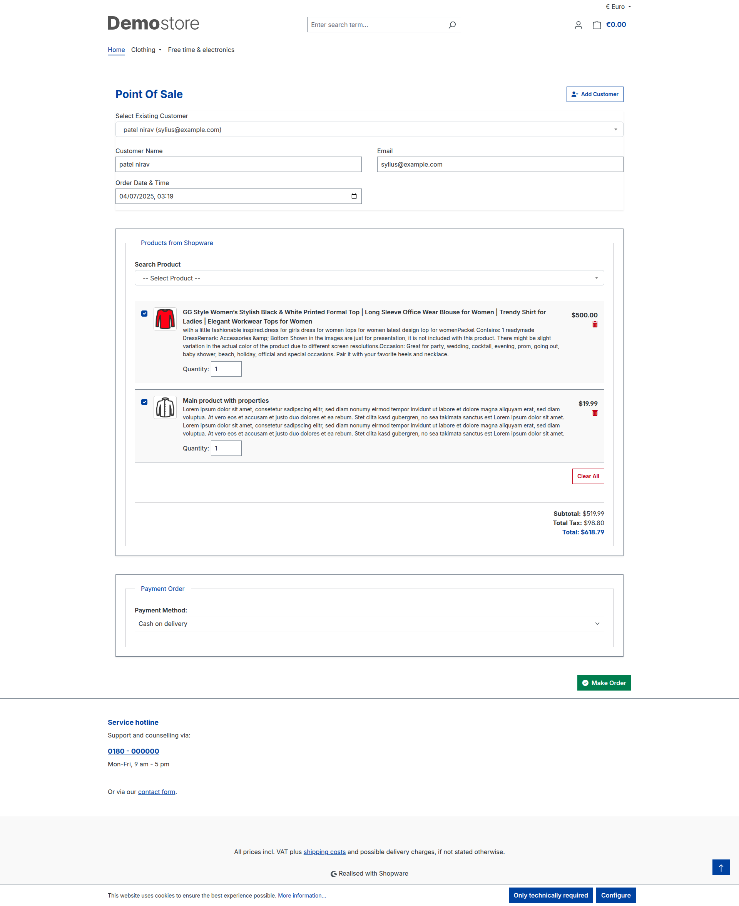
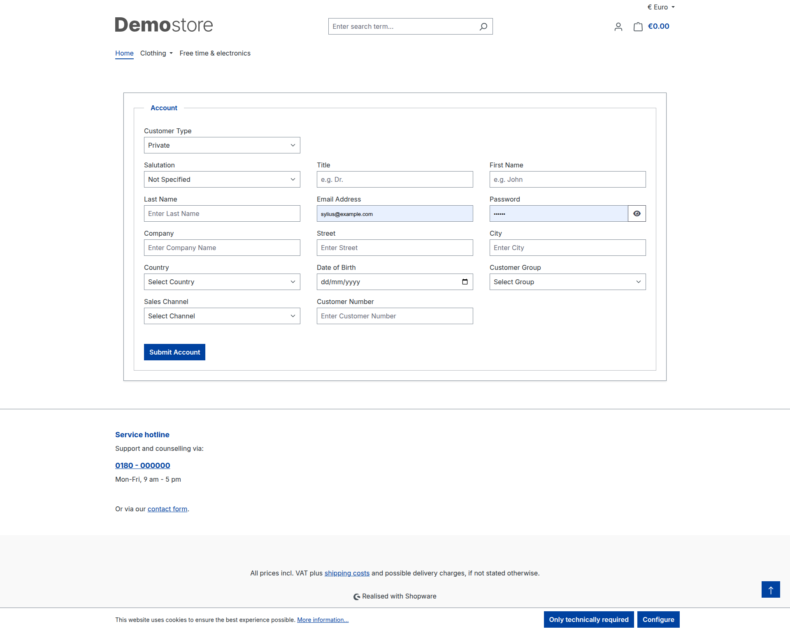

# 🧾 SwagPOS System — Shopware 6 POS Plugin

A lightweight, mobile-friendly Point of Sale (POS) system for Shopware 6.6+ and 6.7+. This plugin allows walk-in sales processing via a standalone interface outside the Shopware admin. Ideal for retail counters, quick order creation, and terminal-based use.

---

## 📦 Features

- 📱 Mobile-friendly responsive one-page POS
- 🔐 Login with Shopware admin credentials
- 💰 Register walk-in sales as Shopware orders
- 🧾 Print/email invoice (printer compatible)
- ➕ Add new customers quickly
- 🛒 Add custom items not in catalog
- ✏️ Adjust product prices manually
- 🧩 Full plugin installation with Shopware integration
- 📄 Easy-to-follow developer documentation
- 🆓 Open-source MIT license

---

## 🔧 Installation

### ✅ Step 1: Copy the Plugin

Place the plugin folder `SwagPOS` in your Shopware project:

```bash
custom/plugins/SwagPOS
```
### ✅ Step 2:  Install and Activate


```bash
bin/console plugin:refresh
bin/console plugin:install --activate SwSimplePos
bin/console cache:clear
```
## 📦 Usage

- Login using your Shopware admin account.

- Search/Add Customer or create a new one.

- Add Products from catalog or create custom items.

- Modify Prices, add Discounts, or change Quantity.

- Submit the form to register order in Shopware.

- Option to Print or Email invoice.

## 📦 Technical Details

- Uses Symfony controllers to handle POS logic

- Uses Twig templates with responsive mobile layout

- Orders are placed using Shopware API endpoints (/api/order)

- Customer creation and address mapping done via /api/customer

- Custom line items allowed (type: custom)

## 📦 REST API Endpoints Used

- POST /api/oauth/token — fetch access token

- GET /api/customer/{id} — get customer details

- POST /api/customer — create new customer

- POST /api/order — create order

- GET /api/product — search Shopware products

## 🔗 Related Links

Shopware 6 Developer Docs

Shopware Admin API

JotForm POS Concept

## Functionality Screenshot





