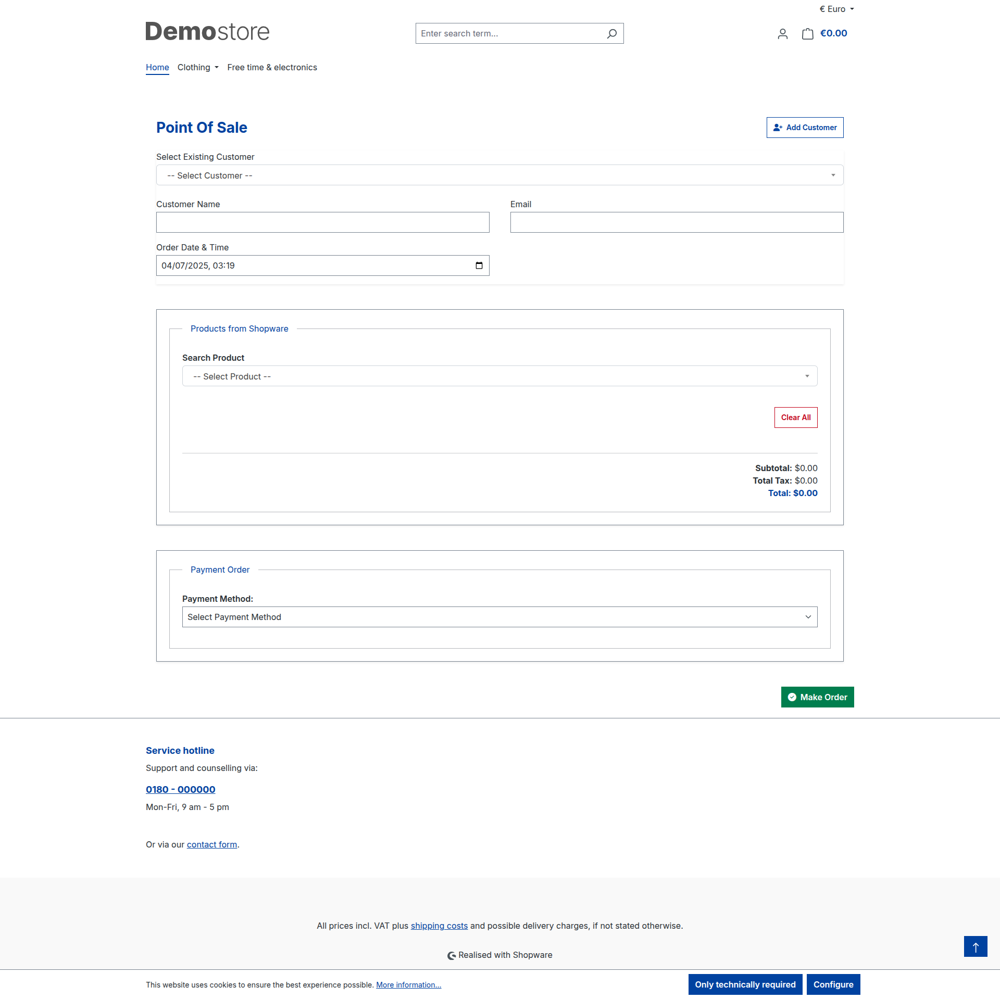

# 🧾 SwagPOS System — Shopware 6 POS Plugin

A lightweight, mobile-friendly Point of Sale (POS) system for Shopware 6.6+ and 6.7+. This plugin allows walk-in sales processing via a standalone interface outside the Shopware admin. Ideal for retail counters, quick order creation, and terminal-based use.

---

## 📦 Features

- 📱 Mobile-friendly responsive one-page POS 

- 🔐 Login with Shopware admin credentials
- 💰 Register walk-in sales as Shopware orders
- 🧾 Print/email invoice (printer compatible)
- ➕ Add new customers quickly
- 🛒 Add custom items not in catalog
- ✏️ Adjust product prices manually
- 🧩 Full plugin installation with Shopware integration
- 📄 Easy-to-follow developer documentation
- 🆓 Open-source MIT license

---

## 🔧 Installation

### ✅ Step 1: Install the Plugin via Composer

In your Shopware project root, run:

```bash
composer require vivanwebsolution/swag-pos
```
### ✅ Step 2:  Install and Activate


```bash
bin/console plugin:refresh
bin/console plugin:install --activate SwSimplePos
bin/console cache:clear
```
🔁 SwSimplePos is the plugin's main class. If you renamed the plugin class, update the command accordingly.


## 📦 Usage

- Login using your Shopware admin account.

- Search/Add Customer or create a new one.

- Add Products from catalog or create custom items.

- Modify Prices, add Discounts, or change Quantity.

- Submit the form to register order in Shopware.

- Option to Print or Email invoice.

## ✅ Requirements

To use the SwagPOS plugin, your system must meet the following requirements:

- 🧩 **Shopware Version:** 6.6 or 6.7 (tested up to 6.7.x)  

- 💻 **PHP Version:** 8.1 or higher

- 🛠️ **Composer:** Required for installation

- 🔐 **Shopware Admin Credentials:** Required for POS login

- 📦 **Shopware Admin API Access:** Required for order and customer handling


## 📡 REST API Endpoints Used

| Method | Endpoint             | Description            |
|--------|----------------------|------------------------|
| POST   | `/api/oauth/token`   | Fetch access token     |
| GET    | `/api/customer/{id}` | Get customer details   |
| POST   | `/api/customer`      | Create a new customer  |
| POST   | `/api/order`         | Create order           |
| GET    | `/api/product`       | Search products        |


## 🔗 Related Links

- [Shopware 6 Developer Documentation](https://developer.shopware.com/)
- [Shopware Admin API Reference](https://shopware.stoplight.io/docs/admin-api/)
- [JotForm POS Concept (UI Inspiration)](https://www.jotform.com/blog/point-of-sale-form-234452/)

## 🖼️ Functionality Screenshots

### 🛒 POS Interface



---

### ➕ Add Product and Customer (Dynamic)


---

### 👤 Add Customer Form


© Vivan Web Solution — Open-source POS plugin for Shopware
